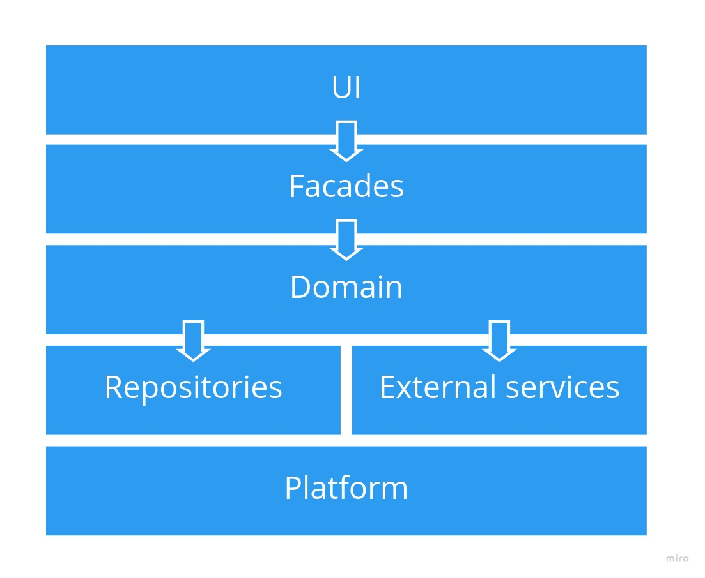

[Software Architecture](../../..) > [Patterns](../..) > [Code Design](..) > Layered Architecture

---

# Layered Architecture

## Description

A layered architecture divides a software component into discrete enclosures that are used to separate the concerns within the component. The enclosures are routinely visualised as horizontal stacked layers, and they group together software units that have similar roles and/or functionality. The grouping does not imply, however, that software units in the same layer are related in the problem domain; they do not have to be.

There are usually rules governing how the layers may interact with each other; typically, a layer may only call software units in the adjacent layer, the calls may not skip over a layer, and usually the calls go in one direction only, e.g. from ‘top’ to ‘bottom.’ This leads naturally to a design where stimulating events are received at an interface layer and processed by a cascade of calls through the layers of the component, from top to bottom and then back out again. This naturally fits web application backends very well.

There are no rules about what the layers are, however, a very common design looks like this:
1. A presentation layer that handles requests and responses from the user interface. If the component is ‘headless,’ i.e. it does not have a UI of its own, this is usually an API layer instead.
2. Optionally, a facade layer that ‘wraps’ the underlying layer, presenting an API customised to the needs of the layer above. This may not be necessary if there is no need for the underlying layer to diverge from the needs of the presentation or API layer.
3. A ‘business’ layer where domain logic resides, insulated from the details of both the UI/API above and the persistent storage below.
4. A persistence layer encapsulating the logic that handles reading and writing of data in the persistent storage.
5. All the above layers may or may not be supported by some kind of generic platform providing services such as dependency injection, database interoperability/ORM, logging, etc.

## Qualities
### Reasons to use it
The pattern is a natural choice for applications where the process flow invariably follows the same sequence, e.g.
1. A request is incoming from some kind of client
2. The relevant data is fetched from the persistent store
3. The data is processed in some way
4. If the request causes data to be modified, the persistent store is updated accordingly
5. A response is formed and sent back to the client

The pattern is easy to implement, easy to enforce with automated verification tools, and provides a straightforward way to achieve separation of concerns and keep the implementation clean. It is a good choice for monolithic applications that are not too large and where there is a need for developers to learn the codebase and be able to make changes reasonably quickly. This is greatly facilitated when the specific layered design is highly stereotyped and familiar to all the developers in the organisation.

The design is straightforward to unit test, since each layer typically only interacts with one other layer and the integration points can be mocked.
### Reasons not to use it
The layered pattern groups software units by their role but not by domain; the design is therefore a poor choice when the software component is large (in terms of count of software units) and particularly when it encompasses multiple domains in the problem space. When the component is large, the layers will necessarily be large, and there will be a need for some other means to impose order. In this case, a modular design may be more appropriate, although the modules can still implement a layered design internally.

The design invariably leads to monolithic components, since the surface between layers can easily grow unchecked, binding each layer very strongly to its neighbour and thus forming a tightly coupled whole. If there are reasons to avoid a monolithic design, such as scalability requirements, that indicates a layered design should also be avoided.

Although layered designs are frequently used in data-driven applications, there is a strong tendency for the data entities to stamp themselves through all the layers like letters in a stick of rock, with highly similar data structures replicated in every layer and functions at each layer interface to convert between them. Any change to the data model typically requires a replicated change to the appropriate data structure in every layer, as well as the data converters on every layer interface.