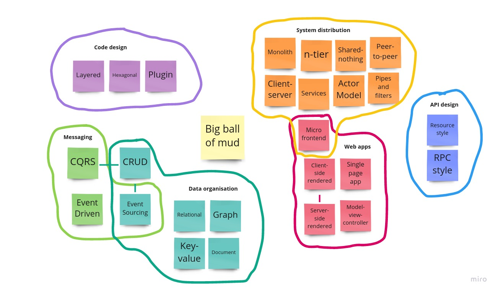

# Software architecture patterns

Architectural designs in software do not need to be invented from scratch for every system, there are by now a number of different architectural patterns that are widely known. These patterns are similar in concept to the better known Gang of Four design patterns in that they are generalised designs that can be applied to software systems to solve common classes of programming problems. The differences are that Gang of Four-style design patterns are intended to be implemented in object-oriented programming languages in particular, and the programming problems they solve are very specific: they are just not *domain* specific. By contrast, architectural patterns are not OO designs, they can be implemented in any programming language, the types of problem they solve are more general, and they lend shape to the whole system: a system cannot be refactored away from an architectural pattern without substantially re-implementing it.

Unlike the Gang of Four design patterns, which were carefully curated and presented in the book of the same name, as far as we know there has been no attempt to do anything similar for architectural patterns. Although most of the patterns are widely known, that knowledge is patchy rather than uniform: the average software engineer can typically name a few patterns, but a software engineer who can discuss many different architectural patterns and elucidate the types of problem each is well suited for is quite rare. Unfortunately, when software engineers are called on to make architectural decisions, all too often they base their choice more on the prevailing fashion at the time than by an analysis of the problem at hand and an objective consideration of the architectural patterns and their respective suitability. This is what we are trying to address here. We are not aware of any serious study of architectural patterns that has systematically collated and presented them, together with the particular aspects of the problem domain that indicate (or contraindicate) the appropriateness of each pattern. This is an attempt to fill that gap.

It should not need to be said (but we shall anyway) that this is most assuredly not a complete list of the architectural patterns that are known, it is merely the ones known to us. And the criterion that makes a design pattern architectural is still rather woolly: we contend that software design becomes architecture when it is difficult to change, but there are degrees of difficulty. Precisely how difficult is left unanswered. Even if it were possible to compile a complete list, it would still only be accurate at the time of writing. More architectural patterns will surely be discovered in the future.

As for the categorisation, that is entirely our own work. We have grouped the architectural patterns covered here into six separate categories:

| Category | Description |
| --- | --- |
| Code design | Patterns of structuring or organising the code internally within an application. |
| System distribution | Patterns of organising systems that are distributed across multiple computers. |
| Messaging | Patterns pertaining to flow of control through a system via messages or events. |
| Web apps | Patterns of structuring and distributing web applications. |
| API design | Patterns of designing remote APIs. |
| Data organisation | Patterns of organising and structuring data in a persistent store. |

Some of these patterns preclude the use of others, for example monoliths and microservices are generally defined in opposition to each other. There are nonetheless many more acceptable combinations than there are incompatible ones. For example, there is nothing to stop you using the CQRS pattern in a monolithic application that employs a hexagonal architecture, or a microservice that is implemented as an n-tier application.

Wherever possible we will describe the patterns in technology-agnostic terms, even in the cases where common products exist that are famously associated with the pattern. We believe that technologies come and go more rapidly than design and architecture patterns do, and it is our hope that by not tying this guide to specific technologies it will remain relevant for longer. There are some exceptions: the web application architectural patterns seemed important enough to include, and it is impossible to discuss those without making reference to HTTP, etc. Similarly, it is not really feasible to discuss resource-oriented API designs without talking about REST and HATEOAS, even though they too are intrinsically associated with HTTP.

## No architecture at all

- The big ball of mud is not in any category because it is not an architectural pattern. It is, rather, the complete absence of architecture in a software system. It deserves mentioning because it could still be argued to be an architectural style, and it is also very common out in the wild, probably more so than we care to admit. It has many severe drawbacks but it is nonetheless not wholly without virtue, and it is instructive to know the forces that drive software systems into this state.

## Code design

- The **layered** architectural pattern aids comprehensibility and discoverability by organising a system’s code into distinct layers, with separate responsibilities assigned to each layer. There are usually rules governing how the layers may talk to each other: for example, the UI layer may talk to the service layer, but not directly to the persistence layer.
- The **hexagonal** pattern (also known as “ports and adapters”) separates core logic from external concerns (such as user interfaces and databases) by exposing “ports” (interfaces) on the core component that define the required protocols separately for each externality. The externalities are connected to the component by “adapters” which plug into the ports to provide the required functionality while also isolating the component from the external details. A hexagonal design treats all externalities on an equal footing, unlike a layered design which by its top-to-bottom orientation implies a hierarchy. The hexagon shape was chosen to make it easy to represent the ports on a diagram, recognising that components often interface with more than two other components (but seldom more than six).
- A **plugin** architecture delegates certain system responsibilities to interchangeable components that are “plugged in” to the host system via a common API that is defined by the host system. Thus the host system has no dependency on its plugins: the plugins can be developed entirely separately by different people, and they may extend the host system’s functionality in ways not anticipated by its creators. The host system and its plugins run as a single process, but the plugins may be linked either statically, which requires the host system to be recompiled, or dynamically, which does not.

## System distribution

- A **monolith** is the degenerate case of distributed systems, being not distributed at all. Monolithic systems typically run in a single process, and they are built and deployed as a single unit.
- The **client-server** model separates the application into multiple rich (or ‘thick’) user interface components (the clients) each in two-way communication with a single common backend (the server). Client-server designs fell out of favour when web applications became popular but have returned in the form of mobile apps, although these designs are not usually referred to as such.
- The **n-tier** architecture separates an application into multiple layers, but unlike the layered architecture pattern, each layer runs on a separate machine. An example would be a web application comprising a web server handling the HTTP requests, an application server where the business logic resides, and a database where the data is persisted.
- A **service-oriented** architecture separates a system into services, which are independent, headless, continuously running processes that handle requests. Services may communicate by calling each other directly or indirectly by passing messages via queues. Microservices are also in this category, but with particular emphasis placed on independent deployability; additionally, a microservice architecture is as much about the team structure and organisation (human interactions) as it is about technical design.
- A **micro frontend** is a reusable web UI component that is designed to be incorporated into a web application. Implementation wise it is very similar to the microservice concept, the main difference being that a micro frontend presents a UI while a microservice does not. As with a microservice, the rationale for creating a micro frontend is independent deployability and scalability.
- A **shared-nothing** architecture allows large jobs to be farmed out to a cluster of nodes, each of which receives a ‘shard’ (portion) of the work. For this pattern to work, it must be possible for each shard to be processed in isolation from all the others, so that the nodes have no need to communicate with each other.
- A **peer-to-peer** architecture is composed of multiple nodes that communicate with each other and self-organise without any central orchestration. Such a system is highly resilient because there is no single point of failure; individual nodes may fail but the whole will continue to operate.
- **Pipes and filters** describes a system composed of reusable components that individually perform simple jobs, and are designed to accept input and/or emit output such that they can be chained together to accomplish far more complicated tasks.
- The **actor model** for concurrency describes a way of optimising a system for high reliability. Actors are concurrent processes that communicate by passing messages to each other. Each actor receives its messages on a dedicated queue from which it consumes the messages one at a time. An individual actor is thus single-threaded while they run concurrently with other actors. The actors are monitored by a supervisor which detects failed actors and restarts them automatically, which is where the resilience comes from. Although the actor model was not originally intended for distributed systems, it certainly can be applied to them: the actor model could certainly be combined with a microservice architecture.

## Messaging

- An **event-driven** architecture inverts the flow of control through a system: rather than one component commanding another component, the first component instead raises an event which the second component is listening for and reacts to appropriately. This allows the system’s components to be decoupled from each other, and gives greater flexibility to alter the system’s behaviour through extension without requiring modification to existing components. When the events are persisted and treated as the primary data source, you have an event sourced system (see data organisation for more details).
- An **event sourced** system implicitly implements the CQRS pattern (command/query responsibility segregation), where the queries (reading data from a persistence store) are separated from the commands (modifying data in a persistence store). It does this by using entities/data structures for modification operations that are distinct from the entities/data structures that are returned by the queries. The CQRS pattern can also be applied to non-event sourced systems: it is also useful in avoiding data inconsistencies due to concurrent updates. It makes a lot of sense when the system producing the data is distinct from the system(s) consuming the data. When the producer and consumer are the same system, the complexity of the design may outweigh its benefits.
- The **CQRS** pattern contrasts with the CRUD design (create, read, update, delete), which uses the same entities or data structures for both queries and updates. CRUD designs are simpler, but care may be needed when updates can occur concurrently.

## Web apps

- Web applications may be classified in two general types: server-side rendered and client-side rendered.
- **Server-side rendered** web applications are where the HTML is generated on the backend and transmitted directly to the browser to be displayed. This lends itself quite naturally to the whole page-at-a-time navigation style, although is frequently supplemented with AJAX calls to enrich the user experience. This style of web application has fallen rather out of favour.
- In server-side rendered web apps, a common way of structuring the code is the **model-view-controller** pattern, where the HTTP requests are handled by controllers, passing model data to a view component which transforms the data into HTML.
- **Client-side rendered** web applications are where the HTML is generated on the front end and interaction with the backend is done through APIs. These invariably utilise some form of Javascript framework.
- The client-side rendered design lends itself quite naturally to the **single page app** architecture. The initial page request loads the whole app, and there are no more whole page roundtrips to the server. All subsequent interactions with the server are more akin to the behavious of a client-server application.
- A **micro frontend** implements a web UI component that can be incorporated into a larger web application. Apart from the UI, it shares many similarities with the microservice pattern.

## API design

- The **RPC** style (remote procedure call) of API design exposes a function or procedure to be called via a network. The words function and procedure have their usual meanings: a function is a query (it returns a result), and a procedure is a command (it causes an effect). RPC-style APIs are generally synchronous (blocking) because an asynchronous API is much more natural to implement in the resource style.
- **Resource** style APIs are oriented around creating, querying, and modifying notional resources on the remote end. These include document-style SOAP APIs as well as RESTful APIs which are modelled as HTTP resources. Asynchronous APIs are natural to implement in the resource style because the initial invocation can create a resource that represents the status (and result, if appropriate) of the asynchronous operation.

## Data organisation

- **Key-value** databases are the simplest form of database. They store singly-valued data, where each data value is associated with a unique key that facilitates efficient retrieval.
- A **document** database is similar to a key-value database except that it facilitates the storing of structured data, typically JSON objects. The database may allow the data to be constrained by a schema or not. It probably facilitates filtering the queried data but cross-referencing is usually difficult.
- **Relational** databases organise data into tables, which are discrete collections of rows (or ‘tuples’). Each table has a schema which defines the columns of every row in the table. A relational database management system (RDBMS) allows tables to be cross-referenced (joined) when they are being queried, and there is no need to predefine the queries when the database is being designed, which is what gives them their power and flexibility. Relational databases are queried and manipulated using a declarative language called SQL (structured query language) which allows arbitrarily table joins to be combined with sophisticated set operations to accomplish very powerful data processing. SQL is a defined standard, although each RDBMS implements its own extensions to the language; in this way the database vendors hope to lock you in.
- A **graph** database stores data as nodes and relationships. Nodes are entities that store structured data as key-value pairs and can be tagged to indicate their roles or types. Relationships are directed connections between nodes, meaning the start and end nodes are not interchangeable. Relationships also have a type, so that a node can have many different kinds of relationships with other nodes. The direction of a relationship is semantic: they can be traversed in either direction when querying. In other words, you can query which department a person works in and you can query which people work in a given department. Unlike relational databases where the joins are cross-referenced on the fly when querying, graph databases persist the relationships along with the nodes.
- An **event sourced** database stores data in the form of a permanent and immutable history of deltas (events) which in principle allow the state of the database at any point in its history to be reconstructed on demand. This contrasts with the standard CRUD model where a single version of each entity is held and updated in place, so no kind of history is maintained.
